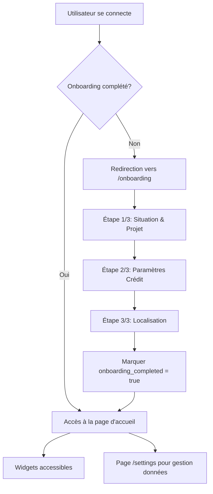

# Plan d'implémentation : Onboarding obligatoire et gestion des données

## Objectifs

- Créer un flux d'onboarding obligatoire en 3 étapes qui collecte les informations essentielles
- Éviter la répétition d'informations entre les widgets
- Ajouter une page de gestion centralisée des données personnelles
- Conserver tous les widgets existants intacts

## Architecture du flux

## Modifications Backend

### 1. Modèle User - Ajout du flag onboarding

**Fichier**: `backend/models.py`

- Ajouter `onboarding_completed = Column(Boolean, default=False)` au modèle `User`
- Migration de base de données nécessaire

### 2. Modèle UserPreferences - Ajout taux d'intérêt

**Fichier**: `backend/models.py`

- Ajouter `taux_interet = Column(Float, default=3.5)` pour stocker le taux d'intérêt collecté dans l'onboarding
- Ce champ sera utilisé par le widget rendement-requis

### 3. API Auth - Endpoints onboarding

**Fichier**: `backend/auth.py`

- Modifier `UserPreferencesSchema` pour inclure `taux_interet`
- Ajouter endpoint `PUT /auth/onboarding/complete` pour marquer l'onboarding comme complété
- Modifier `GET /auth/me` pour retourner `onboarding_completed`
- Modifier `GET /auth/preferences` pour retourner `taux_interet`

## Modifications Frontend

### 1. Page d'onboarding

**Nouveau fichier**: `frontend/app/onboarding/page.tsx`

- Page unique avec 3 étapes (1/3, 2/3, 3/3)
- Navigation par étapes avec validation obligatoire
- **Étape 1** : Situation personnelle + Projet (regroupe données Faisabilité)
  - Statut, ancienneté, revenu mensuel
  - Prix du bien, apport, durée crédit
  - Garant, revenu garant
  - Co-emprunteur (optionnel)
- **Étape 2** : Paramètres crédit (simplifié)
  - Taux d'intérêt (nouveau champ obligatoire)
  - Affiche montant emprunté calculé (prix - apport)
  - Affiche apport et durée (pré-remplis, non modifiables)
  - Option inclure charges (20%)
- **Étape 3** : Localisation
  - Ville domicile (obligatoire)
  - Villes relais (optionnel)
  - Rayon recherche (défaut 20km)
- Sauvegarde progressive à chaque étape
- Validation finale → marquer onboarding_completed = true

### 2. Middleware de protection des routes

**Nouveau fichier**: `frontend/middleware.ts` (ou logique dans layout)

- Vérifier si utilisateur est authentifié ET onboarding_completed
- Si non complété → redirection vers `/onboarding`
- Exceptions : `/login`, `/register`, `/onboarding` accessibles sans onboarding

### 3. Page de gestion des données

**Nouveau fichier**: `frontend/app/settings/page.tsx`

- Section "Données personnelles" avec tous les champs collectés
- Groupement logique :
  - **Situation** : statut, ancienneté, revenu, co-emprunteur
  - **Projet** : prix bien, apport, durée crédit
  - **Crédit** : taux intérêt, inclure charges
  - **Localisation** : ville domicile, villes relais, rayon
- Formulaire éditable avec sauvegarde
- Lien vers widgets pour simulations avancées

### 4. Navigation - Ajout lien Settings

**Fichier**: `frontend/app/page.tsx` et composants de navigation

- Ajouter lien "Paramètres" ou "Mes données" dans la navigation
- Accessible uniquement si authentifié

### 5. Hook d'authentification - Vérification onboarding

**Fichier**: `frontend/lib/auth.tsx`

- Modifier `User` interface pour inclure `onboarding_completed`
- Vérifier le statut onboarding après login/register
- Redirection automatique si nécessaire

### 6. Page d'accueil - Protection

**Fichier**: `frontend/app/page.tsx`

- Vérifier onboarding_completed au chargement
- Rediriger vers `/onboarding` si non complété

## Conservation des widgets existants

Tous les widgets existants restent intacts et accessibles :

- `/widgets/faisabilite` - Conserve toutes ses fonctionnalités
- `/widgets/rendement-requis` - Conserve toutes ses fonctionnalités, peut utiliser taux_interet de l'onboarding
- `/widgets/proximite-domicile` - Conserve toutes ses fonctionnalités
- Tous les autres widgets - Aucune modification

Les widgets peuvent toujours être utilisés pour :

- Faire des simulations avec différents paramètres
- Explorer différentes configurations
- Accéder aux visualisations et analyses

## Flux utilisateur

1. **Première connexion** :

   - Utilisateur se connecte/inscrit
   - Redirection automatique vers `/onboarding`
   - Complète les 3 étapes (obligatoire)
   - Accès à la plateforme après validation

2. **Utilisation normale** :

   - Accès à la page d'accueil avec tous les widgets
   - Peut utiliser n'importe quel widget pour des simulations
   - Peut modifier ses données via `/settings`

3. **Modification des données** :

   - Via `/settings` pour modification centralisée
   - Via widgets individuels pour simulations spécifiques

## Points techniques importants

- **Validation** : Chaque étape doit valider les champs obligatoires avant de continuer
- **Sauvegarde progressive** : Sauvegarder à chaque étape pour ne pas perdre les données
- **UX** : Indicateur de progression clair (1/3, 2/3, 3/3)
- **Performance** : Charger les préférences existantes si l'utilisateur revient sur l'onboarding
- **Sécurité** : Vérifier l'authentification sur toutes les routes protégées

## Migration de données

Pour les utilisateurs existants :

- `onboarding_completed = False` par défaut
- Ils seront redirigés vers l'onboarding à leur prochaine connexion
- Leurs données existantes seront pré-remplies dans l'onboarding s'ils ont déjà sauvegardé des préférences