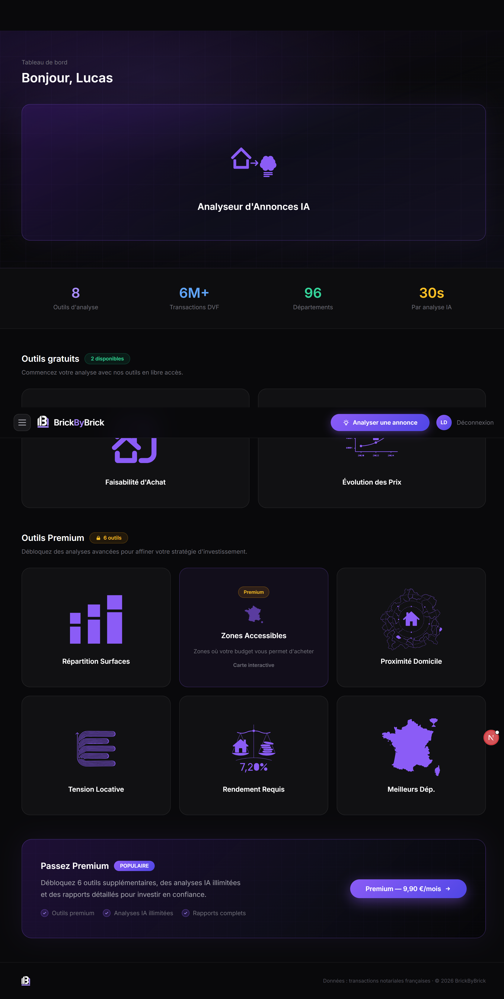
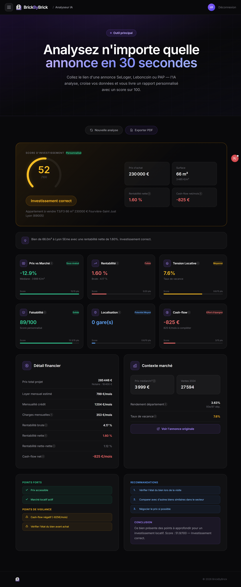
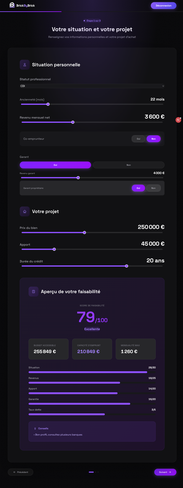
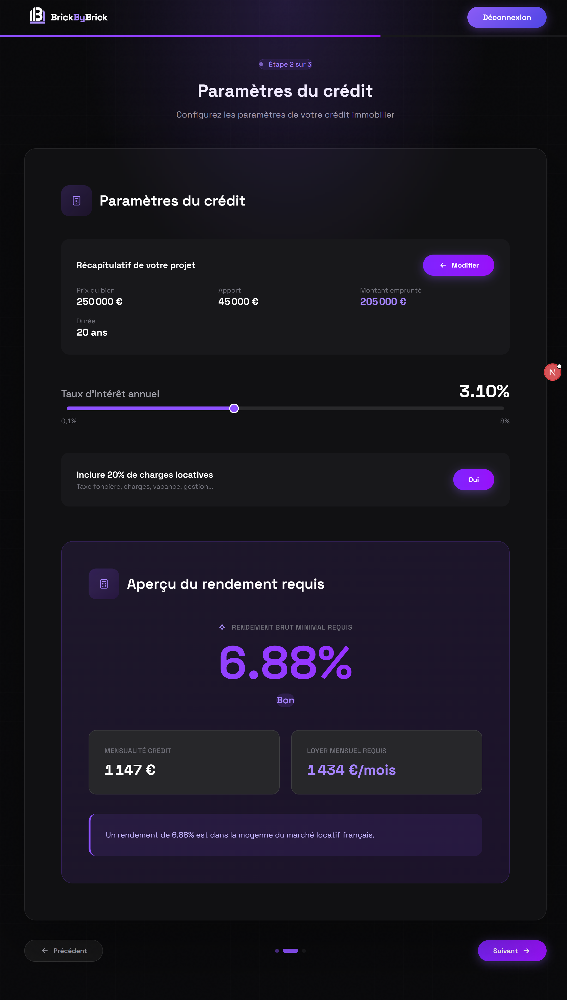
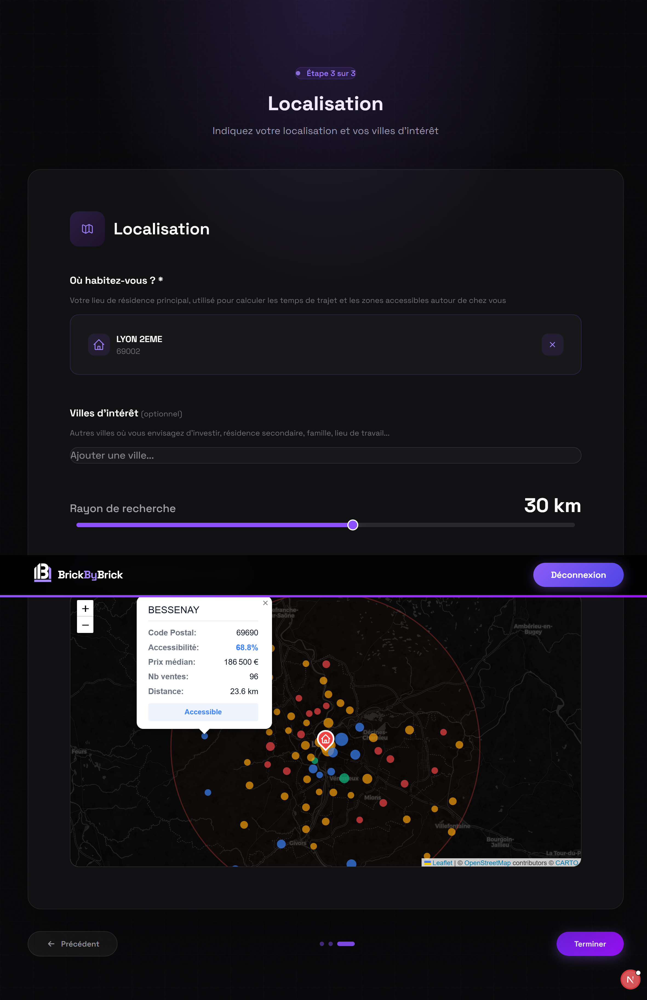

# BrickByBrick

**AI-powered rental property investment platform for the French market.**

BrickByBrick helps investors evaluate rental properties by combining real estate data (DVF), NLP-based listing analysis, and interactive decision-support tools - all in a single full-stack application.

Built solo, from backend to frontend.



---

## Features

### AI Listing Analyzer
Paste any rental listing URL - the AI scrapes it, extracts key characteristics via NLP, and generates a personalized investment report in under 30 seconds: scoring, yield estimate, price positioning, and rental potential.



### Smart Onboarding
A guided 3-step flow that builds your investor profile: financial situation, credit parameters (with live feasibility scoring), and target location with an interactive map of accessible zones.

<p align="center">
  
  
  
</p>

### 12 Interactive Widgets
Decision-support tools organized in free and premium tiers:

| Free | Premium |
|------|---------|
| Purchase Feasibility | Surface Distribution |
| Price Trends | Accessible Zones Map |
| | Home Proximity |
| | Rental Tension |
| | Required Yield |
| | Department Ranking |
| | DVF Comparator |
| | Best Departments |

Each widget pulls live data, adapted to the user's profile and target criteria.

---

## Tech Stack

| Layer | Stack |
|-------|-------|
| **Frontend** | Next.js 16, React 19, TypeScript, Tailwind CSS, Recharts, Leaflet |
| **Backend** | FastAPI, Python, SQLAlchemy, Pydantic |
| **Data** | DVF (government real estate transactions), web scraping, NLP extraction |
| **Auth** | JWT stateless authentication (jose + bcrypt) |
| **Maps** | Leaflet + pgeocode for geocoding and radius search |
| **AI** | LLM-powered listing analysis with structured output |

---

## Architecture

```
BrickByBrick/
├── backend/
│   ├── main.py              # FastAPI app - API routes & endpoints
│   ├── ai_analyzer.py       # AI listing analysis pipeline (scrape + NLP + report)
│   ├── scraper.py            # Web scraper for real estate listings
│   ├── widgets.py            # Widget computation logic
│   ├── finance.py            # Financial calculations (yield, feasibility, credit)
│   ├── data_loader.py        # DVF data loading & preprocessing (Singleton)
│   ├── auth.py               # JWT authentication & user management
│   ├── models.py             # SQLAlchemy ORM models
│   ├── schemas.py            # Pydantic validation schemas
│   └── zones_precompute.py   # Geographic zone precomputation
│
├── frontend/
│   ├── app/
│   │   ├── page.tsx          # Landing page
│   │   ├── dashboard/        # Main dashboard
│   │   ├── onboarding/       # 3-step investor profiling
│   │   ├── analyze/          # AI listing analyzer
│   │   ├── widgets/          # Individual widget pages
│   │   └── settings/         # User settings
│   ├── components/           # Reusable UI components
│   └── lib/                  # API client & auth helpers
│
└── data/                     # DVF datasets (CSV, not tracked)
```

---

## Getting Started

### Prerequisites
- Python 3.10+
- Node.js 18+

### Backend

```bash
cd backend
pip install -r requirements.txt
cp env.example .env          # Add your API keys
python main.py               # Starts on http://localhost:8000
```

### Frontend

```bash
cd frontend
npm install
cp .env.local.example .env.local
npm run dev                  # Starts on http://localhost:3000
```

API docs available at `http://localhost:8000/docs` (Swagger UI).

---

## Status

This is an active personal project. Core features are functional - onboarding, dashboard, AI analyzer, and all 12 widgets. Planned next steps include production deployment and mobile responsiveness.

---

## Author

**Jules Mortreux** - Engineering student in Data & AI at ECE Paris.

[](https://www.linkedin.com/in/jules-mortreux-960421292/)
[](https://github.com/julesmortreux)
